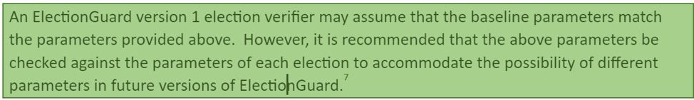
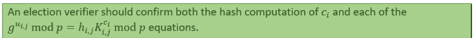
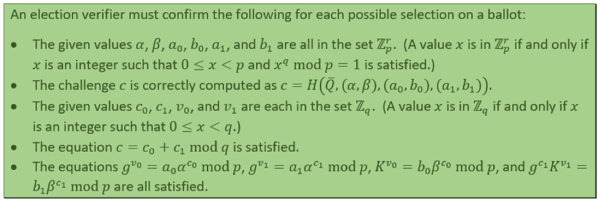
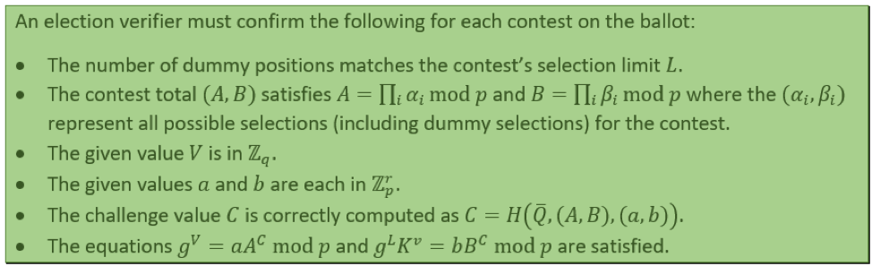
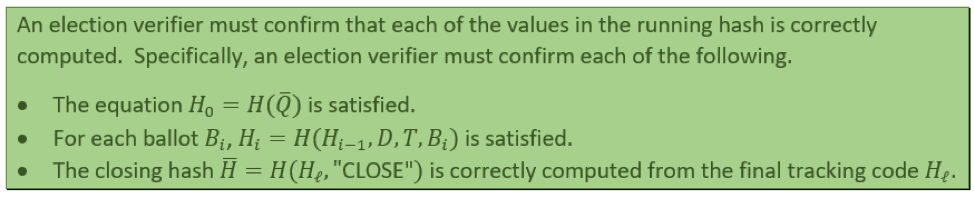
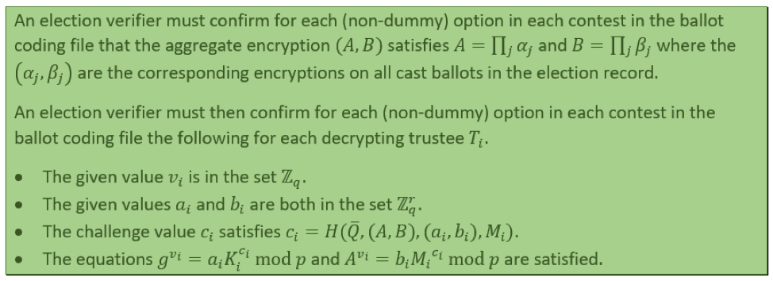

Welcome to the election verifiers repo! Please visit our landing
[website](https://albertli354.github.io/election-varifiers-info-capstone/) for more info.

## Who We Are:
We are a group of four students from the University of Washington’s iSchool. This
repository is an accumulation of the work we have done for our project on the ElectionGuard
Verifier. We have been working on this project in conjunction with [Dr. Josh
Benaloh](https://www.microsoft.com/en-us/research/people/benaloh/), who is a Senior Principal
Cryptographer at Microsoft Research.

[ElectionGuard](https://github.com/microsoft/electionguard) is a free, open-source
system that uses homomorphic encryption to allow for end-to-end verification of votes in an
election. End-to-end verification means that voters using this system would be able to vote
discreetly, and then be able to check whether their votes were correctly counted afterward,
without revealing their votes. Currently, American elections do not have any sort of system built
in to ensure the integrity of votes, so ElectionGuard is attempting to tackle that issue.
What we have created in this repo is a verifier. 

The verifier checks election data is
correctly counted. ElectionGuard produces all of this data using an El-Gamal encryption style,
and Dr. Benaloh’s mathematical proofs to translate the specifications into usable code. The
verifier we have built is an early-stage project, so there have been many roadblocks along the
way; it is as complete as can be given the current situation. Though this is not a fully-fledged
verifier (it verifies and checks, but not to the desired completion level yet), we hope that we have
paved the way for future developers to finish and improve upon our work.

Outside of the verifier, we have also designed and developed a website that tackles the
task of informing the general public about what ElectionGuard is and why it is necessary.
Certain features on the site like “Try It Out” and “Developer” are unfinished and still conceptual.
The website is an example of ElectionGuard’s potential capabilities.

After May 29th, 2020, we will cease working and updating this project. Our sponsor, Dr.
Josh Benaloh, will resume control of this project again after this date.

## What’s Included In The Repo

- The [data](/data) folder contains the records of the Wisconsin pilot election held in Fulton,
Wisconsin. ElectionGuard has processed this data.
- The [docs](/docs) folder contains the implementation of our landing website. You can visit it
[here](https://albertli354.github.io/election-varifiers-info-capstone/index.html).
- The Python Jupyter notebook contains a referenced implementation of the election verifier.

## How To Build And Deploy
We developed the verifier in Python using a Jupyter Notebook. You can clone the repository
and run it on your local machine. We feel it is best to improve the verifier in a Jupyter Notebook
further.

## Acknowledgment
We want to thank Dr. Josh Benaloh, our sponsor at Microsoft Research, for explaining the
mathematical concepts of the verifier in great detail. We also want to thank Frank Martinez and
Emily Porter, our instructor and teaching assistant in our capstone course, for providing
constructive feedback and guidance.

## About The Verifier:
A working verifier checks all the computations and decryptions listed in the “green boxes” in
ElectionGuard Specification authored by Dr. Josh Benaloh. However, there are a few features
we weren’t able to implement due to problems outside of our scope. Our verifier currently does
not perform the following. Implementation of the first and last bullets can occur with more
information:

- Our current verifier does not implement any hash computations or verifications due to
    problems with the generation of hashes. Implementation of Hash computations is
    possible with new information and further direction from Microsoft Research.
- Our current verifier does not implement any missing Trustee Verification, listed in green
    boxes 7 and 8. Our pilot data (Wisconsin Election Data) is not applicable - all of the
    trustees were present.
- Our current verifier does not implement the row product (As and Bs in selection limit
    proof in green box 4) of alphas and betas (encryptions of the selection in the ballot - zero
    or one) due to problems in the data set. ElectionGuard software may not have had this
    correctly implemented as of the time working on this project as a potential answer for
    why.

- [x] GB 1 Parameters

This part of the verifier confirms the validity of the parameters in data. The parameters are the
number of trustees, the threshold of trustees, and if the generator was computed correctly
according to spec.

- This part corresponds to the [parameters] section of the pilot data.

- [x] GB 2 Correct Key Generation

This part of the verifier sets up the proof of knowledge of trustees involved. In this voting
process, election trustees then apply their keys to decrypt the tallies and provide evidence that
the polls are correct. In addition to confirming hash computations, the equation shown above
checks that each trustee has its own set of public keys. One primary key (first public key
generated for each trustee in data) and other keys are used to share private keys in case of a
missing trustee. The goal is not to compromise the public key at any point.

- This part corresponds to the [trustee_public_keys] section of the pilot data.

- [x] GB 3 Selection Correctness

This part of the verifier confirms each possible selection (candidate) on a ballot.

- This part corresponds to the [cast_ballots] section of the pilot data.
- First, it checks everything is in proper subgroups Zpr (they are
    very large values - encryptions such as alpha, beta, a0, b0, a1, b1) and if they are
    computed correctly.
- It also checks for a smaller group Zq - used for challenges (c0, c1) and
    responses (v0, v1).
- The Chaum - Pedersen proof is used in equations for the last bullet point to verify the
    selection correctness, particularly proving the decryption of the selection as 0 or 1. It is
    worth noting that in our pilot data, K and alpha are swapped, which resulted in the
    swapping in our verifier as well.

- [x] GB 4 Selection Limit Proof

Box 4 checks the selection limit. For example, with selection limit 1, you are not allowed to vote
for more than one candidate. Mainly, the section is composed of the integrity of votes castable
and the circumstances surrounding the integrity of the vote.

- This part corresponds to the [num_selection_proof] section of the pilot data.
- Not included in the verifier: As and Bs are the row product of alphas and betas
    (explained in the introduction).
- It checks if the response (V) is in Zq group.
- It checks if a and b are in proper subgroups Zpr and if they
    are computed correctly.

- It is using The Chaum-Pedersen Proof here to prove that it has precisely the correct
    number of 1s (a dummy position is also considered 1 to make sure the total is 1, usually
    would be 0. If the selection limit is 2, there are two dummy positions to fulfill, again, the
    selection limit).
- The pilot data swapped K & A; therefore, they also are exchanged in our verifier.

- [ ] GB 5 Hashing

- Not included in our verifier (more explained in the introduction).

- [x] GB 6 Verifiable Decryption

This part of the verifier goes over the decryption of tallies.

- This section corresponds to the [contest_tallies] section as well as [cast_ballots] section
    of the pilot data.
- Column products of alphas and betas (corresponding encryptions on all cast ballots)
    compute the total number of votes (tally) for each possible candidate/selection, A and B.
- It also checks if numbers are in proper groups, as explained in other sections.
- Each one of the trustees has to use their secret key to form their own M, which is the
    share of the decryption. Combining these keys decrypts the tally.
- The Chaum-Pedersen Proof proves that the tallies are correct.

- [ ] GB 7 Missing Trustee

- Not included in our verifier (more explained in the introduction).

- [ ] GB 8 Missing Trustee II (Lagrange)

- Not included in our verifier (more explained in the introduction).

- [x] GB 9 Tallies Verification

This part of the verifier will take the tallies (which is the count of all of the votes for a specific
selection/candidate) and confirms a correct count. Verification occurs by taking the encrypted
tally, decrypting it, and matching the decrypted score compared to the exponentiated number of
votes. Additive homomorphic property handles this encryption. Consult the specification for a
more detailed explanation.

- This part corresponds to the [contest_tallies] section of the pilot data.
- It takes in each trustee’s share (Mi) and decrypted tally (M, exponential form of score) to
    see if it matches the exponential style of an encrypted tally.
- The variable “t” here corresponds to the actual numerical count of votes (tallies).

- [x] GB 10 Spoiled Ballots Verification

One aspect of the ElectionGuard system is the use of spoiled ballots. Spoiled ballots are ballots
that have been spoiled by voters, thus do not count toward the actual election. After the
election, to prove encryption, and the correct ballot count, these ballots may be revealed to
voters. Spoiled ballots are individually decrypted, unlike cast ballots, and the verifier correctly
confirms such individual decryption.

- This part corresponds to the [spoiled_ballots] section of the pilot data.
- For the most part, this section reuses the checks from the green box 6 “Verifiable
    Decryption.” Since spoiled ballots are individually decrypted, however, the aggregation
    of encryptions (alphas and beta) will not be implemented.

## Contact Information

- Hansol Kim (Back-End Developer) - hansol7@uw.edu
- Xiang Li (Back-End Developer) - albertli354@gmail.com
- Ajay Qi (Front-End Developer)- ajayqidesign@gmail.com
- Nicola Kalderash (Project Manager) - kderash0@uw.edu

